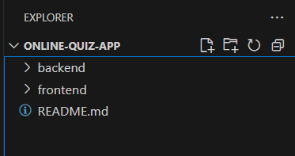
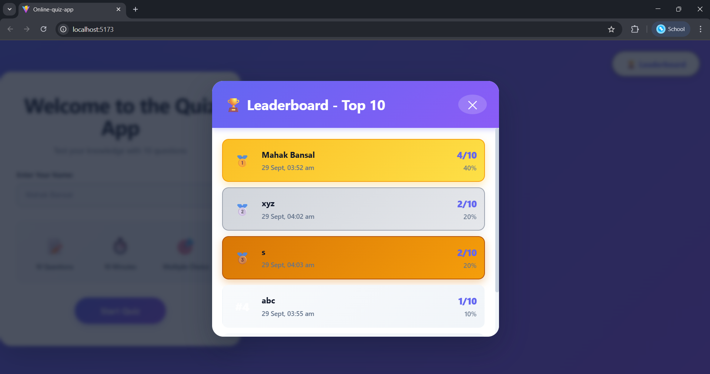
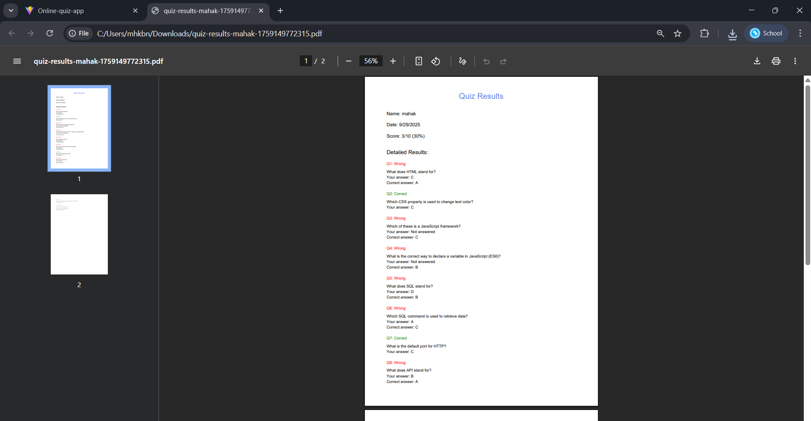

# Online Quiz Application

A full-stack web application built for the Verto ASE Challenge, demonstrating comprehensive technical skills through an interactive quiz platform with real-time scoring, timer functionality, and performance tracking.



## Table of Contents
- [Challenge Context](#challenge-context)
- [Project Overview](#project-overview)
- [Tech Stack](#tech-stack)
- [Features](#features)
- [Project Structure](#project-structure)
- [Database Schema](#database-schema)
- [API Endpoints](#api-endpoints)
- [Setup Instructions](#setup-instructions)
- [Screenshots](#screenshots)
- [Development Process](#development-process)

## Challenge Context

This application was developed as a response to Verto's Associate Software Engineer (ASE) Challenge, which required building a full-stack quiz application within a 4-6 hour timeframe.

Challenge Requirements Met:
- Full-stack implementation (React + Node.js + SQLite)
- Core features: question display, answer submission, score calculation
- Navigation: Previous/Next buttons between questions
- Database integration for storing questions and results
- API endpoints for fetching questions and submitting answers
- Complete user flow from start to finish

Bonus Features Implemented:
- Timer functionality (10-minute countdown)
- Answer review showing correct/incorrect responses
- Backend tests for scoring logic
- Username input for personalized experience
- Leaderboard showing top performers
- PDF export functionality
- Extended question bank (10 questions across multiple domains)

## Project Overview

This quiz application assesses technical knowledge across five domains:
1. HTML/CSS - Web markup and styling fundamentals
2. JavaScript - Modern JS concepts and frameworks
3. Databases - SQL and query language understanding
4. Networking - HTTP, APIs, and web protocols
5. General Programming - Data structures and algorithms

The application emphasizes user experience with smooth interactions, clear visual feedback, and comprehensive performance tracking.

## Tech Stack

Backend
- Node.js - JavaScript runtime environment
- Express.js - Web application framework
- SQLite3 - Lightweight relational database
- Jest & Supertest - Testing framework

Frontend
- React 18 - UI library with hooks
- Vite - Build tool and development server
- Custom CSS3 - Styling with modern features
- jsPDF - Client-side PDF generation

Development
- npm - Package management
- Git - Version control
- Nodemon - Development auto-reload

## Features

Core Functionality
- Question Display: 10 multiple-choice questions with four options each
- Navigation System: Move between questions using Previous/Next buttons
- Answer Selection: Click to select answers with visual feedback
- Score Calculation: Backend validation and scoring
- Results Display: Comprehensive breakdown of performance

Enhanced Features
- Timer: 10-minute countdown with auto-submit on timeout
- Progress Tracking: Visual progress bar and question counter
- Username Input: Personalized quiz sessions
- Leaderboard: Top 10 scores with timestamps
- Answer Review: Detailed right/wrong breakdown after submission
- PDF Export: Download results as formatted PDF
- Responsive Design: Works across desktop and mobile devices

## Project Structure


```
online-quiz-app/
├── backend/
│   ├── node_modules/
│   ├── tests/
│   │   └── api.test.js
│   ├── database.js
│   ├── package.json
│   ├── package-lock.json
│   ├── quiz.db
│   └── server.js
├── frontend/
│   ├── node_modules/
│   ├── public/
│   ├── src/
│   │   ├── components/
│   │   │   ├── Home.jsx
│   │   │   ├── Leaderboard.jsx
│   │   │   ├── Question.jsx
│   │   │   └── Result.jsx
│   │   ├── App.css
│   │   ├── App.jsx
│   │   └── main.jsx
│   ├── .gitignore
│   ├── eslint.config.js
│   ├── index.html
│   ├── package.json
│   ├── package-lock.json
│   ├── README.md
│   └── vite.config.js
├── images/
│   ├── backend terminal.png
│   ├── home page.png
│   ├── leaderboard.png
│   ├── pdf.png
│   ├── project structure.png
│   ├── project.png
│   ├── ques page.png
│   ├── result page 2.png
│   ├── result page.png
│   ├── table data 1.png
│   ├── table data.png
│   └── table schema.png
└── README.md
```

## Database Schema

questions Table

Stores quiz questions with multiple-choice options.

| Column | Type | Constraints | Description |
|--------|------|-------------|-------------|
| id | INTEGER | PRIMARY KEY, AUTOINCREMENT | Unique question identifier |
| question_text | TEXT | NOT NULL | The question content |
| option_a | TEXT | NOT NULL | First answer choice |
| option_b | TEXT | NOT NULL | Second answer choice |
| option_c | TEXT | NOT NULL | Third answer choice |
| option_d | TEXT | NOT NULL | Fourth answer choice |
| correct_option | TEXT | NOT NULL | Correct answer (a/b/c/d) |

quiz_attempts Table

Records user quiz attempts with scores.

| Column | Type | Constraints | Description |
|--------|------|-------------|-------------|
| id | INTEGER | PRIMARY KEY, AUTOINCREMENT | Unique attempt identifier |
| user_name | TEXT | - | Name of quiz taker |
| score | INTEGER | NOT NULL | Number of correct answers |
| total_questions | INTEGER | NOT NULL | Total questions answered |
| timestamp | DATETIME | DEFAULT CURRENT_TIMESTAMP | Submission time |


## API Endpoints

GET /api/health

Purpose: Health check endpoint

Response:
```json
{
  "status": "ok",
  "message": "Quiz API is running"
}
```

GET /api/questions

Purpose: Fetch all quiz questions (correct answers excluded)

Response:
```json
{
  "questions": [
    {
      "id": 1,
      "question_text": "What does HTML stand for?",
      "option_a": "Hyper Text Markup Language",
      "option_b": "High Tech Modern Language",
      "option_c": "Home Tool Markup Language",
      "option_d": "Hyperlinks and Text Markup Language"
    }
  ]
}
```

POST /api/submit

Purpose: Submit quiz answers and receive scored results

Request Body:
```json
{
  "answers": {
    "1": "a",
    "2": "b",
    "3": "c"
  },
  "userName": "Mahak Bansal"
}
```

Response:
```json
{
  "score": 8,
  "total": 10,
  "percentage": 80,
  "results": [
    {
      "questionId": 1,
      "userAnswer": "a",
      "correctAnswer": "a",
      "isCorrect": true
    }
  ]
}
```

GET /api/leaderboard

Purpose: Retrieve top 10 quiz scores

Response:
```json
{
  "leaderboard": [
    {
      "user_name": "Mahak Bansal",
      "score": 9,
      "total_questions": 10,
      "percentage": 90,
      "timestamp": "2025-09-29 12:30:00"
    }
  ]
}
```

## Setup Instructions

Prerequisites
- Node.js (v14+)
- npm

Backend Setup

```bash
# Navigate to backend directory
cd backend

# Install dependencies
npm install

# Start development server
npm run dev

# Run tests (optional)
npm test
```

Backend will run on http://localhost:5000

Frontend Setup

```bash
# Navigate to frontend directory
cd frontend

# Install dependencies
npm install

# Start development server
npm run dev
```

Frontend will run on http://localhost:5173

Verify Installation
1. Open browser to http://localhost:5173
2. Ensure backend is running at http://localhost:5000
3. Test by starting a quiz

## Screenshots

Home Page


Question Page


Result Page


Leaderboard



PDF Report



Backend Terminal


Database Tables


## Development Process

Time Investment: ~6 hours

Approach: Iterative development with focus on core features first, then enhancements

Phase 1 (1.5h): Backend setup, database design, API implementation
Phase 2 (2h): Frontend components, quiz flow, state management
Phase 3 (1h): Styling, responsive design, UX improvements
Phase 4 (1h): Bonus features (leaderboard, PDF export)
Phase 5 (0.5h): Testing, bug fixes, documentation

Developer: Mahak Bansal
Date: September 2025
Challenge: Verto ASE Technical Assessment